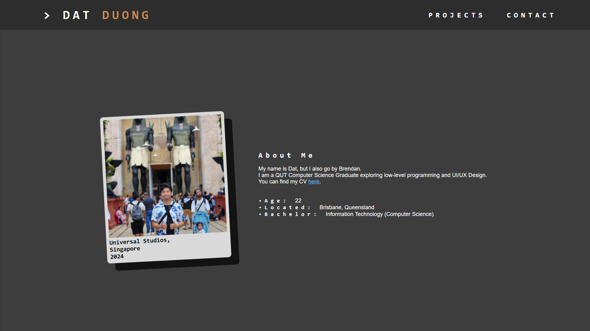
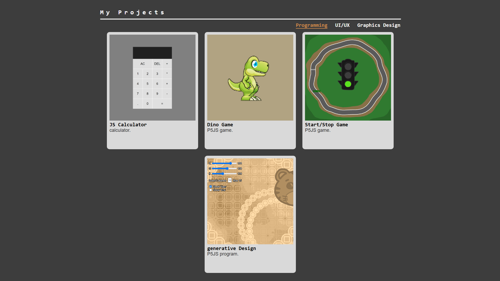

# 🚀 Dev-Duong Portfolio

A personal portfolio site built with **React** and **Tailwind CSS**, deployed on **GitHub Pages**.

---

## 📦 Tech Stack

- **HTML5** – Markup language for structuring web content
- **CSS3** – Styling and layout design
- **JavaScript** – For interactive behavior
- **GitHub Pages** – Static site hosting

---

## 🎨 Assets & Resources

- UI prototyped in [Figma](https://figma.com/)

---

## 🔄 Deploying Updates

After making changes to your files:

```bash
git add .
git commit -m "Describe your update"
git push origin main
```

~~This builds the app and deploys the latest version to:~~  
🔗 https://dev-duong.github.io (Note: This URL no longer hosts this project)

## 📷 Preview

Here is a preview of the project:



